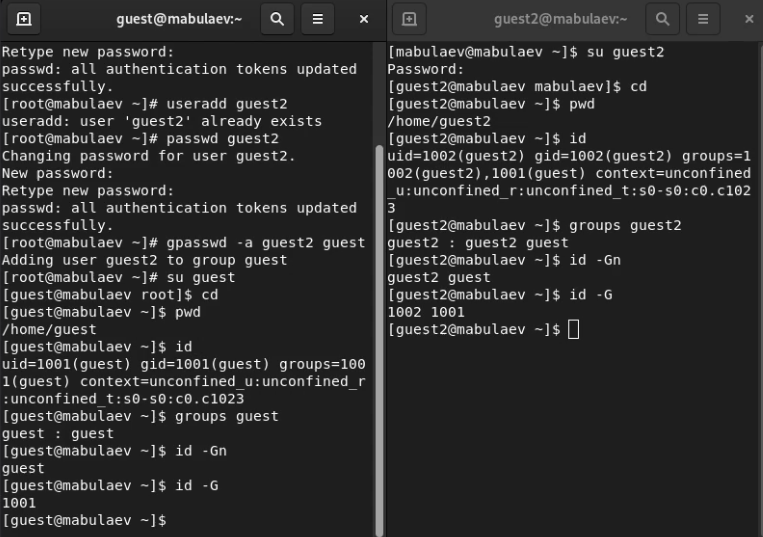
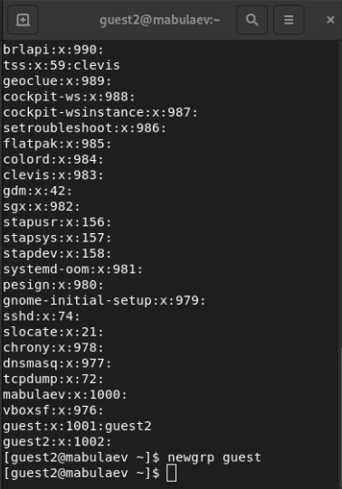
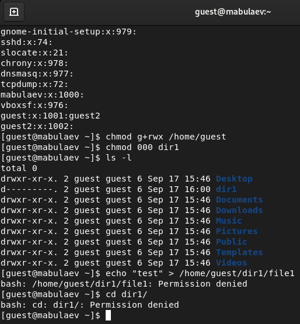
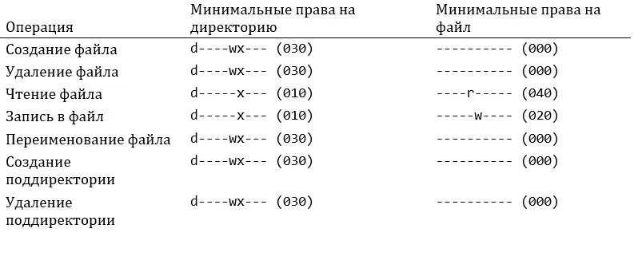

---
## Front matter
lang: ru-RU
title: Дискреционное разграничение прав в Linux. Основные атрибуты
author: |
	 Булаев Максим Александрович НПИ-01-19 \inst{1}

institute: |
	\inst{1} Российский Университет Дружбы Народов

date: 23 сентября, 2022, Москва, Россия

## Formatting
mainfont: PT Serif
romanfont: PT Serif
sansfont: PT Sans
monofont: PT Mono
toc: false
slide_level: 2
theme: metropolis
header-includes: 
 - \metroset{progressbar=frametitle,sectionpage=progressbar,numbering=fraction}
 - '\makeatletter'
 - '\beamer@ignorenonframefalse'
 - '\makeatother'
aspectratio: 43
section-titles: true

---

## Цель лабораторной работы

Получение практических навыков работы в консоли с атрибутами файлов для групп пользователей.

# Процесс выполнения лабораторной работы

## Определяем UID и группу двух пользователей

{ #fig:001 width=75% height=75% }

## Файл с данными о пользователях

{ #fig:002 width=75% height=75% }

## Атрибуты директории

{ #fig:003 width=75% height=75% }

## Права и разрешённые действия

{ #fig:004 width=100% height=100% }

## Вывод

Таким образом, в ходе данной лабораторной работы я приобрёл практические навыки работы в консоли с атрибутами файлов для групп пользователей.